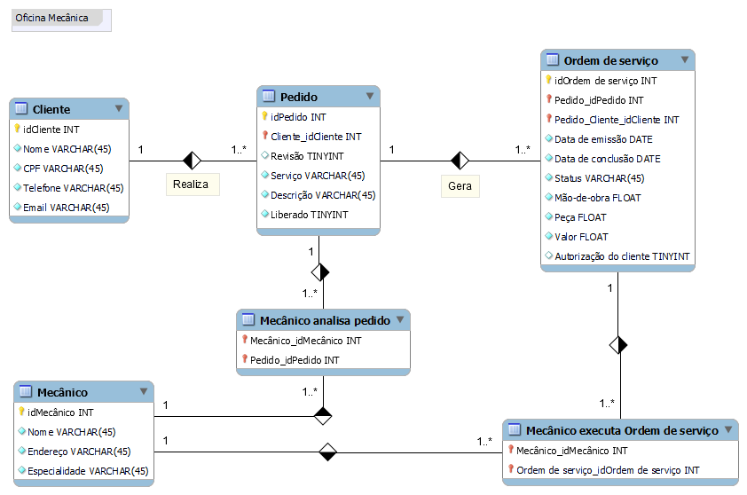

# Modelagem Entidade-Relacionamento Oficina Mecânica, Ordem de Serviço
## Descrição do projeto
Projeto de modelagem de uma ordem de serviço de uma oficina mecânica, utilizado o método de entidade-relacionamento.

## Modelagem

